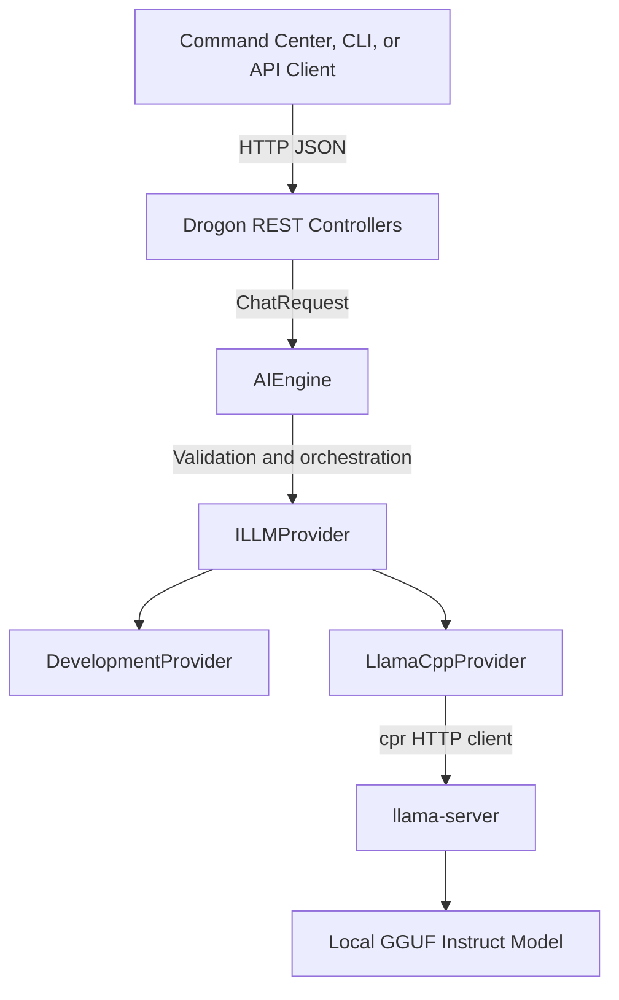

# Athena Command Engine

<div align="center">


<strong>Native C++23 AI orchestration for the Platform Engineering Command Center</strong>

<p>
  A resilient REST service built with Drogon, cpr, JsonCpp, GoogleTest, CTest, CMake, and llama.cpp.
</p>


</div>

---

## Overview

Athena Command Engine is a native C++23 AI orchestration service designed to power the intelligence layer of the **Platform Engineering Command Center**.

Athena accepts structured chat requests, validates domain rules, delegates inference through a replaceable provider interface, and returns predictable JSON responses with typed errors, latency data, and request correlation IDs.

The service currently supports a deterministic development provider and includes the foundation for local inference through `llama-server`. Real llama.cpp readiness and chat completion are the next active milestones.

> **Project status:** The service foundation, REST API, error contract, provider abstraction, automated unit tests, and automated REST lifecycle tests are operational. Real GGUF-backed inference is under active development.

---

## Vision

Athena is not intended to be only a chat wrapper. The final system will provide an AI operations layer for the Platform Engineering Command Center.

```text
Platform Engineering Command Center
React 19 + TypeScript + Vite
                 |
                 | HTTPS REST
                 v
Athena Command Engine
C++23 + Drogon + AIEngine
                 |
                 | Provider abstraction
                 v
LlamaCppProvider
                 |
                 | OpenAI-compatible REST
                 v
llama-server
                 |
                 v
Local GGUF instruct model
```

The integrated experience will expose:

- Athena process health
- provider readiness
- selected provider and model
- AI-assisted operational analysis
- request and provider latency
- structured failures
- request trace IDs
- provider telemetry
- graceful offline behavior

---

## Current Capabilities

### Implemented

- C++23 domain and service architecture
- Drogon HTTP server
- health endpoint
- resilient chat endpoint
- request validation through `AIEngine`
- replaceable `ILLMProvider` abstraction
- deterministic `DevelopmentProvider`
- configurable `LlamaCppProvider` foundation
- cpr HTTP-client dependency integration
- structured JSON errors
- request ID header and body correlation
- GoogleTest unit suites
- CTest test discovery
- network-level REST integration tests
- automated Athena startup, health polling, testing, and shutdown
- CMake presets and Ninja builds

### In progress

- llama.cpp provider readiness check
- OpenAI-compatible chat completion calls
- safe upstream response parsing
- provider timeout and connection-failure mapping
- environment-based provider selection
- provider-aware readiness endpoint
- Command Center CORS policy
- real GGUF model smoke testing

---

## Architecture



### Layer responsibilities

#### REST controllers

- Parse client JSON
- construct domain requests
- invoke the orchestration layer
- create JSON responses
- attach request IDs
- translate typed errors into HTTP responses

#### AIEngine

- Validates prompts
- enforces request limits
- validates temperature and token settings
- checks provider readiness
- delegates valid inference requests

#### Providers

- `DevelopmentProvider` returns deterministic responses for CI and development
- `LlamaCppProvider` will communicate with a local OpenAI-compatible llama.cpp server
- future providers can be added without changing `AIEngine`

---

## Why C++23?

Athena uses C++23 to combine native performance with explicit ownership and strongly typed domain behavior.

The implementation emphasizes:

- RAII resource management
- smart-pointer ownership
- dependency injection
- pure virtual interfaces
- const correctness
- type-safe durations with `std::chrono`
- stable domain objects independent of HTTP
- compile-time validation and strict warning flags

Example provider contract:

```cpp
class ILLMProvider
{
public:
    virtual ~ILLMProvider() = default;

    virtual athena::core::ChatResult chat(
        const athena::core::ChatRequest& request) = 0;

    [[nodiscard]] virtual bool isReady() const = 0;
};
```

The engine depends on this abstraction instead of a specific inference runtime. This keeps orchestration testable and allows providers to evolve independently.

---

## REST API

### Health

```http
GET /api/v1/health
```

Health answers whether the Athena process is alive.

```json
{
  "service": "athena-command-engine",
  "status": "healthy",
  "version": "0.1.0"
}
```

### Chat

```http
POST /api/v1/chat
Content-Type: application/json
```

Example request:

```json
{
  "prompt": "Explain RAII in C++.",
  "model": "local-model",
  "temperature": 0.2,
  "maxTokens": 128
}
```

Current development-provider response:

```json
{
  "data": {
    "answer": "Athena received: Explain RAII in C++.",
    "model": "development-provider",
    "latencyMs": 0
  },
  "meta": {
    "requestId": "b1377bbd79f505ef"
  }
}
```

### Readiness

Planned for Athena v0.1.0:

```http
GET /api/v1/ready
```

Readiness will answer whether Athena can serve inference through the selected provider.

```json
{
  "status": "ready",
  "provider": "llama.cpp",
  "providerReady": true,
  "model": "local-instruct-model",
  "version": "0.1.0"
}
```

---

## Error Contract

Athena returns stable public error codes rather than requiring clients to parse arbitrary exception messages.

| Condition | Error code | HTTP status |
|---|---|---:|
| Malformed JSON | `INVALID_JSON` | 400 |
| Invalid request values | `VALIDATION_FAILED` | 400 |
| Provider unavailable | `PROVIDER_UNAVAILABLE` | 503 |
| Provider timeout | `PROVIDER_TIMEOUT` | 504 |
| Invalid provider response | `PROVIDER_INVALID_RESPONSE` | 502, planned |
| Unexpected Athena failure | `INTERNAL_ERROR` | 500 |

```json
{
  "error": {
    "code": "VALIDATION_FAILED",
    "message": "The prompt field is required.",
    "requestId": "a6ab7354722ae939"
  }
}
```

Unexpected internal exception details are not returned to clients.

---

## Testing

Athena currently has **23 unit tests** and **nine REST integration scenarios**.

```text
AIEngineTest                 7
DevelopmentProviderTest     4
ErrorResponseTest           7
LlamaCppProviderTest        5
Unit tests                  23
REST scenarios               9
CTest entries               24
```

CTest reports 24 entries because the 23 unit tests are discovered individually and the complete REST lifecycle is registered as one integration entry.

### Covered behavior

- valid orchestration
- empty and oversized prompts
- invalid temperatures
- invalid token limits
- unavailable providers
- null provider rejection
- deterministic development responses
- typed error serialization
- request ID consistency
- malformed JSON
- unknown routes
- LlamaCppProvider constructor validation
- automated server lifecycle cleanup

### Build and run all tests

```bash
cmake --build --preset macos-debug &&
ctest --preset macos-debug --output-on-failure
```

### Run the unit-test executable

```bash
./build/athena_unit_tests
```

### Run only LlamaCppProvider tests

```bash
./build/athena_unit_tests \
  --gtest_filter='LlamaCppProviderTest.*'
```

### Run the REST lifecycle directly

```bash
./scripts/run_rest_api_tests.sh
```

---

## Prerequisites

The current macOS development environment uses Homebrew packages.

```bash
brew install \
  cmake \
  ninja \
  llvm \
  drogon \
  googletest \
  cpr \
  llama.cpp
```

Verify key tools:

```bash
cmake --version
ninja --version
llama-server --version
```

---

## Build

Clone the repository:

```bash
git clone \
  https://github.com/Gift3dMyndZ/athena-command-engine.git

cd athena-command-engine
```

Configure:

```bash
cmake --preset macos-debug
```

Build:

```bash
cmake --build --preset macos-debug
```

Run Athena:

```bash
./build/athena
```

---

## Local llama.cpp Development

Model weights are intentionally excluded from Git.

```bash
mkdir -p ~/Models
```

For an 8 GB Apple Silicon development machine, begin with a small 1B to 3B instruct model using Q4 quantization.

```bash
llama-server \
  --model ~/Models/your-model.gguf \
  --host 127.0.0.1 \
  --port 8080 \
  --ctx-size 2048
```

Validate health:

```bash
BASE_URL="$(printf 'http\x3a\x2f\x2f127.0.0.1:8080')"

curl \
  --silent \
  --show-error \
  --include \
  "${BASE_URL}/health"
```

Validate chat directly before testing Athena:

```bash
curl \
  --silent \
  --show-error \
  --request POST \
  "${BASE_URL}/v1/chat/completions" \
  --header 'Content-Type: application/json' \
  --data '{
    "model": "local-model",
    "messages": [
      {
        "role": "user",
        "content": "Explain RAII in two concise sentences."
      }
    ],
    "temperature": 0.2,
    "max_tokens": 128,
    "stream": false
  }'
```

---

## Project Structure

```text
athena-command-engine/
├── CMakeLists.txt
├── CMakePresets.json
├── include/
│   └── athena/
│       ├── api/
│       ├── core/
│       └── providers/
├── src/
│   ├── api/
│   ├── core/
│   ├── providers/
│   └── main.cpp
├── tests/
│   ├── integration/
│   └── unit/
└── scripts/
    └── run_rest_api_tests.sh
```

---

## Configuration Roadmap

Athena v0.1.0 will support environment-based provider selection.

```text
ATHENA_PROVIDER=development
ATHENA_LLM_URL=<local or hosted provider URL>
ATHENA_LLM_TIMEOUT_MS=30000
```

Expected behavior:

```text
ATHENA_PROVIDER=development
    -> DevelopmentProvider

ATHENA_PROVIDER=llama.cpp
    -> LlamaCppProvider
```

Unknown or invalid configuration will fail startup with a clear error.

---

## Command Center Integration

Athena will remain in a separate repository from the Platform Engineering Command Center.

```text
Gift3dMyndZ.github.io
    React and TypeScript frontend
    visualization and portfolio
    command interface

athena-command-engine
    C++ service
    AI orchestration
    provider integration
    REST contract
```

The Command Center will integrate through a typed TypeScript client rather than by copying backend source.

Planned frontend capabilities:

- Athena health card
- provider readiness card
- command intelligence console
- curated operational prompts
- request ID display
- Athena and provider latency
- provider telemetry
- request trace panel
- graceful offline state
- development and demo modes

---

## Zero-Cost Showcase Architecture

The portfolio-grade integrated system can operate without recurring cloud-service charges.

```text
Always available
    GitHub Pages Command Center
    documentation and architecture
    demo and offline states

Available while owner infrastructure runs
    Athena C++ API
    llama.cpp
    local GGUF model
    live provider telemetry
```

A temporary HTTPS tunnel can expose the local Athena service for scheduled demonstrations. The permanent public site should continue to work when Athena is offline.

This is a showcase architecture, not a substitute for the authentication, rate limiting, monitoring, and hardened hosting required by a permanent public inference service.

---

## Security Principles

- never commit GGUF model weights
- never commit `.env` files or credentials
- never embed private secrets in Vite `VITE_*` variables
- restrict production CORS to known origins
- validate prompt and token limits
- enforce provider timeouts
- avoid logging complete prompts by default
- return safe public error messages
- shut down temporary public tunnels after demonstrations
- add authentication and rate limiting before permanent public exposure

The repository ignores:

```gitignore
/build/
/cmake-build-*/
.env
.env.local
*.log
*.pid
/models/
*.gguf
```

---

## Roadmap

### Athena v0.1.0

- [x] C++23 orchestration core
- [x] Drogon health and chat endpoints
- [x] provider abstraction
- [x] deterministic development provider
- [x] structured errors and request IDs
- [x] automated unit and REST tests
- [x] configurable llama.cpp provider foundation
- [ ] llama.cpp readiness check
- [ ] OpenAI-compatible chat completion
- [ ] deterministic provider HTTP tests
- [ ] 502, 503, and 504 provider error mapping
- [ ] environment-based provider selection
- [ ] provider-aware readiness endpoint
- [ ] CORS configuration
- [ ] real GGUF model smoke test
- [ ] GitHub Actions CI
- [ ] initial release documentation

### Command Center v1.1.0

- [ ] typed Athena API client
- [ ] Athena status card
- [ ] readiness polling
- [ ] command intelligence console
- [ ] prompt presets
- [ ] request ID and latency display
- [ ] offline and demo states
- [ ] accessibility tests

### Athena v0.2.0

- [ ] structured provider logging
- [ ] metrics
- [ ] request and concurrency limits
- [ ] Docker image
- [ ] telemetry endpoint
- [ ] hosted deployment configuration

### Command Center v1.2.0

- [ ] provider telemetry
- [ ] request trace panel
- [ ] repository-aware prompt presets
- [ ] architecture explanations
- [ ] operational intelligence views
- [ ] model diagnostics

---

## Release Criteria for v0.1.0

Athena v0.1.0 will be tagged when:

- a licensed instruct GGUF model is selected
- llama-server health and direct chat succeed
- `LlamaCppProvider::isReady()` is implemented
- `LlamaCppProvider::chat()` is implemented
- provider failures are mapped safely
- provider tests are deterministic
- provider selection is configuration driven
- `/api/v1/ready` is operational
- CORS allows only known origins
- DevelopmentProvider behavior remains green
- the complete CTest suite passes
- a real model smoke test passes
- CI passes
- documentation is complete
- no secrets or model binaries are tracked

---

## Engineering Principles

1. **Separate transport from domain policy.**
2. **Depend on provider abstractions rather than concrete runtimes.**
3. **Keep tests independent from multi-gigabyte model files.**
4. **Treat failures as part of the public API contract.**
5. **Distinguish process health from provider readiness.**
6. **Preserve request correlation across success and failure paths.**
7. **Keep the public portfolio functional when AI infrastructure is offline.**
8. **Use local inference without pretending unlimited public compute is free.**
9. **Publish small, coherent, testable commits.**
10. **Document operational limitations honestly.**

---

## Related Project

Athena is being developed as the AI intelligence backend for the Platform Engineering Command Center:

- [Command Center repository](https://github.com/Gift3dMyndZ/Gift3dMyndZ.github.io)
- [Live Command Center](https://gift3dmyndz.github.io/)

The projects remain independently buildable and deployable.

---

## Author

**Joshua Wolfe**

- [GitHub](https://github.com/Gift3dMyndZ)
- [LinkedIn](https://www.linkedin.com/in/mrjoshuawolfe)
- [Platform Engineering Command Center](https://gift3dmyndz.github.io/)

---

## License

Athena Command Engine is licensed under the [MIT License](LICENSE).

Copyright © 2026 Joshua Wolfe.

---

## Current Capabilities

### Implemented

- C++23 domain and service architecture
- Drogon HTTP server
- health endpoint
- resilient chat endpoint
- request validation through `AIEngine`
- replaceable `ILLMProvider` abstraction
- deterministic `DevelopmentProvider`
- configurable `LlamaCppProvider` foundation
- cpr HTTP-client dependency integration
- structured JSON errors
- request ID header and body correlation
- GoogleTest unit suites
- CTest test discovery
- network-level REST integration tests
- automated Athena startup, readiness polling, testing, and shutdown
- CMake presets and Ninja builds

### In progress

- llama.cpp provider readiness check
- OpenAI-compatible chat completion calls
- safe upstream response parsing
- provider timeout and connection-failure mapping
- environment-based provider selection
- provider-aware readiness endpoint
- Command Center CORS policy
- real GGUF model smoke testing

---

## Architecture


### Layer responsibilities

#### REST controllers

- parse client JSON
- construct domain requests
- invoke the orchestration layer
- create JSON responses
- attach request IDs
- translate typed errors into HTTP responses

#### AIEngine

- validates prompts
- enforces request limits
- validates temperature and token settings
- checks provider readiness
- delegates valid inference requests

#### Providers

- `DevelopmentProvider` returns deterministic responses for CI and development
- `LlamaCppProvider` will communicate with a local OpenAI-compatible llama.cpp server
- future providers can be added without changing `AIEngine`

---

## Why C++23?

Athena uses C++23 to combine native performance with explicit ownership and strongly typed domain behavior.

The implementation emphasizes:

- RAII resource management
- smart-pointer ownership
- dependency injection
- pure virtual interfaces
- const correctness
- type-safe durations with `std::chrono`
- stable domain objects independent of HTTP
- compile-time validation and strict warning flags

Example provider contract:

```cpp
class ILLMProvider
{
public:
    virtual ~ILLMProvider() = default;

    virtual athena::core::ChatResult chat(
        const athena::core::ChatRequest& request) = 0;

    [[nodiscard]] virtual bool isReady() const = 0;
};
```

The engine depends on this abstraction instead of a specific inference runtime. This keeps orchestration testable and allows providers to evolve independently.

---

## REST API

### Health

```http
GET /api/v1/health
```

Health answers whether the Athena process is alive.

Example response:

```json
{
  "service": "athena-command-engine",
  "status": "healthy",
  "version": "0.1.0"
}
```

### Chat

```http
POST /api/v1/chat
Content-Type: application/json
```

Example request:

```json
{
  "prompt": "Explain RAII in C++.",
  "model": "local-model",
  "temperature": 0.2,
  "maxTokens": 128
}
```

Current development-provider response:

```json
{
  "data": {
    "answer": "Athena received: Explain RAII in C++.",
    "model": "development-provider",
    "latencyMs": 0
  },
  "meta": {
    "requestId": "b1377bbd79f505ef"
  }
}
```

### Readiness

Planned for Athena v0.1.0:

```http
GET /api/v1/ready
```

Readiness will answer whether Athena can serve inference through the selected provider.

Planned response:

```json
{
  "status": "ready",
  "provider": "llama.cpp",
  "providerReady": true,
  "model": "local-instruct-model",
  "version": "0.1.0"
}
```

---

## Error Contract

Athena returns stable public error codes rather than requiring clients to parse arbitrary exception messages.

| Condition | Error code | HTTP status |
|---|---|---:|
| Malformed JSON | `INVALID_JSON` | 400 |
| Invalid request values | `VALIDATION_FAILED` | 400 |
| Provider unavailable | `PROVIDER_UNAVAILABLE` | 503 |
| Provider timeout | `PROVIDER_TIMEOUT` | 504 |
| Invalid provider response | `PROVIDER_INVALID_RESPONSE` | 502, planned |
| Unexpected Athena failure | `INTERNAL_ERROR` | 500 |

Example:

```json
{
  "error": {
    "code": "VALIDATION_FAILED",
    "message": "The prompt field is required.",
    "requestId": "a6ab7354722ae939"
  }
}
```

Unexpected internal exception details are not returned to clients.

---

## Testing

Athena currently has **23 unit tests** and **nine REST integration scenarios**.

```text
AIEngineTest                 7
DevelopmentProviderTest     4
ErrorResponseTest           7
LlamaCppProviderTest        5
Unit tests                  23
REST scenarios               9
CTest entries               24
```

CTest reports 24 entries because the 23 unit tests are discovered individually and the complete REST lifecycle is registered as one integration entry.

### Covered behavior

- valid orchestration
- empty and oversized prompts
- invalid temperatures
- invalid token limits
- unavailable providers
- null provider rejection
- deterministic development responses
- typed error serialization
- request ID consistency
- malformed JSON
- unknown routes
- LlamaCppProvider constructor validation
- automated server lifecycle cleanup

### Build and run all tests

```bash
cmake --build --preset macos-debug &&
ctest --preset macos-debug --output-on-failure
```

### Run the unit-test executable

```bash
./build/athena_unit_tests
```

### Run only LlamaCppProvider tests

```bash
./build/athena_unit_tests \
  --gtest_filter='LlamaCppProviderTest.*'
```

### Run the REST lifecycle directly

```bash
./scripts/run_rest_api_tests.sh
```

---

## Prerequisites

The current macOS development environment uses Homebrew packages.

```bash
brew install \
  cmake \
  ninja \
  llvm \
  drogon \
  googletest \
  cpr \
  llama.cpp
```

Verify key tools:

```bash
cmake --version
ninja --version
llama-server --version
```

---

## Build

Clone the repository:

```bash
git clone \
  https://github.com/Gift3dMyndZ/athena-command-engine.git

cd athena-command-engine
```

Configure:

```bash
cmake --preset macos-debug
```

Build:

```bash
cmake --build --preset macos-debug
```

Run Athena:

```bash
./build/athena
```

The service listens on the configured local Athena port.

---

## Local llama.cpp Development

Model weights are intentionally excluded from Git.

Create an external model directory:

```bash
mkdir -p ~/Models
```

For an 8 GB Apple Silicon development machine, begin with a small 1B to 3B instruct model using a Q4 quantization.

Example server pattern:

```bash
llama-server \
  --model ~/Models/your-model.gguf \
  --host 127.0.0.1 \
  --port 8080 \
  --ctx-size 2048
```

Validate health:

```bash
BASE_URL="$(printf 'http\x3a\x2f\x2f127.0.0.1:8080')"

curl \
  --silent \
  --show-error \
  --include \
  "${BASE_URL}/health"
```

Validate chat directly before testing Athena:

```bash
curl \
  --silent \
  --show-error \
  --request POST \
  "${BASE_URL}/v1/chat/completions" \
  --header 'Content-Type: application/json' \
  --data '{
    "model": "local-model",
    "messages": [
      {
        "role": "user",
        "content": "Explain RAII in two concise sentences."
      }
    ],
    "temperature": 0.2,
    "max_tokens": 128,
    "stream": false
  }'
```

---

## Project Structure

```text
athena-command-engine/
├── CMakeLists.txt
├── CMakePresets.json
├── include/
│   └── athena/
│       ├── api/
│       ├── core/
│       └── providers/
├── src/
│   ├── api/
│   ├── core/
│   ├── providers/
│   └── main.cpp
├── tests/
│   ├── integration/
│   └── unit/
└── scripts/
    └── run_rest_api_tests.sh
```

---

## Configuration Roadmap

Athena v0.1.0 will support environment-based provider selection.

```text
ATHENA_PROVIDER=development
ATHENA_LLM_URL=<local or hosted provider URL>
ATHENA_LLM_TIMEOUT_MS=30000
```

Expected behavior:

```text
ATHENA_PROVIDER=development
    -> DevelopmentProvider

ATHENA_PROVIDER=llama.cpp
    -> LlamaCppProvider
```

Unknown or invalid configuration will fail startup with a clear error.

---

## Command Center Integration

Athena will remain in a separate repository from the Platform Engineering Command Center.

```text
Gift3dMyndZ.github.io
    React and TypeScript frontend
    visualization and portfolio
    command interface

athena-command-engine
    C++ service
    AI orchestration
    provider integration
    REST contract
```

The Command Center will integrate through a typed TypeScript client rather than by copying backend source.

Planned frontend capabilities:

- Athena health card
- provider readiness card
- command intelligence console
- curated operational prompts
- request ID display
- Athena and provider latency
- provider telemetry
- request trace panel
- graceful offline state
- development and demo modes

---

## Zero-Cost Showcase Architecture

The portfolio-grade integrated system can operate without recurring cloud-service charges.

```text
Always available
    GitHub Pages Command Center
    documentation and architecture
    demo and offline states

Available while owner infrastructure runs
    Athena C++ API
    llama.cpp
    local GGUF model
    live provider telemetry
```

A temporary HTTPS tunnel can expose the local Athena service for scheduled demonstrations. The permanent public site should continue to work when Athena is offline.

This is a showcase architecture, not a substitute for the authentication, rate limiting, monitoring, and hardened hosting required by a permanent public inference service.

---

## Security Principles

- never commit GGUF model weights
- never commit `.env` files or credentials
- never embed private secrets in Vite `VITE_*` variables
- restrict production CORS to known origins
- validate prompt and token limits
- enforce provider timeouts
- avoid logging complete prompts by default
- return safe public error messages
- shut down temporary public tunnels after demonstrations
- add authentication and rate limiting before permanent public exposure

The repository ignores:

```gitignore
/build/
/cmake-build-*/
.env
.env.local
*.log
*.pid
/models/
*.gguf
```

---

## Roadmap

### Athena v0.1.0

- [x] C++23 orchestration core
- [x] Drogon health and chat endpoints
- [x] provider abstraction
- [x] deterministic development provider
- [x] structured errors and request IDs
- [x] automated unit and REST tests
- [x] configurable llama.cpp provider foundation
- [ ] llama.cpp readiness check
- [ ] OpenAI-compatible chat completion
- [ ] deterministic provider HTTP tests
- [ ] 502, 503, and 504 provider error mapping
- [ ] environment-based provider selection
- [ ] provider-aware readiness endpoint
- [ ] CORS configuration
- [ ] real GGUF model smoke test
- [ ] GitHub Actions CI
- [ ] initial release documentation

### Command Center v1.1.0

- [ ] typed Athena API client
- [ ] Athena status card
- [ ] readiness polling
- [ ] command intelligence console
- [ ] prompt presets
- [ ] request ID and latency display
- [ ] offline and demo states
- [ ] accessibility tests

### Athena v0.2.0

- [ ] structured provider logging
- [ ] metrics
- [ ] request and concurrency limits
- [ ] Docker image
- [ ] telemetry endpoint
- [ ] hosted deployment configuration

### Command Center v1.2.0

- [ ] provider telemetry
- [ ] request trace panel
- [ ] repository-aware prompt presets
- [ ] architecture explanations
- [ ] operational intelligence views
- [ ] model diagnostics

---

## Release Criteria for v0.1.0

Athena v0.1.0 will be tagged when:

- a licensed instruct GGUF model is selected
- llama-server health and direct chat succeed
- `LlamaCppProvider::isReady()` is implemented
- `LlamaCppProvider::chat()` is implemented
- provider failures are mapped safely
- provider tests are deterministic
- provider selection is configuration driven
- `/api/v1/ready` is operational
- CORS allows only known origins
- DevelopmentProvider behavior remains green
- the complete CTest suite passes
- a real model smoke test passes
- CI passes
- documentation is complete
- no secrets or model binaries are tracked

---

## Engineering Principles

Athena is built around the following principles:

1. **Separate transport from domain policy.**
2. **Depend on provider abstractions rather than concrete runtimes.**
3. **Keep tests independent from multi-gigabyte model files.**
4. **Treat failures as part of the public API contract.**
5. **Distinguish process health from provider readiness.**
6. **Preserve request correlation across success and failure paths.**
7. **Keep the public portfolio functional when AI infrastructure is offline.**
8. **Use local inference without pretending unlimited public compute is free.**
9. **Publish small, coherent, testable commits.**
10. **Document operational limitations honestly.**

---

## Related Project

Athena is being developed as the AI intelligence backend for the Platform Engineering Command Center:

- Command Center repository: `Gift3dMyndZ/Gift3dMyndZ.github.io`
- Live Command Center: `https://gift3dmyndz.github.io/`

The projects remain independently buildable and deployable.

---

## Author

**Joshua Wolfe**

- GitHub: `https://github.com/Gift3dMyndZ`
- LinkedIn: `https://www.linkedin.com/in/mrjoshuawolfe`
- Command Center: `https://gift3dmyndz.github.io/`

---

